# Execution Plan — AI-DLC Studio

## Detailed Analysis Summary

### Change Impact Assessment
- **User-facing changes**: Yes — the entire product is user-facing (novel card-based Q&A, gates, editing, retro desktop).
- **Structural changes**: Yes — greenfield architecture (UI shell, workflow engine, provider/storage adapters, API layer).
- **Data model changes**: Yes — domain model for Project/Stage/Artifact/Question/Answer + on-disk persistence schema.
- **API changes**: Yes — new internal HTTP API (projects, vision, stage runner, settings).
- **NFR impact**: Yes — security (blocking), performance/streaming, portability (local-first/deploy-ready), testability (partial PBT).

### Risk Assessment
- **Risk Level**: Medium-High — new product; AI orchestration; code-generation is a frontier capability.
- **Rollback Complexity**: Easy (greenfield; no production system to regress).
- **Testing Complexity**: Moderate — pure engine/parsing/serialization are unit- and property-testable; AI + UI integration tested with the Mock provider.
- **Mitigations**: Mock provider for deterministic, key-free runs and tests; generic stage runner so all stages share one well-tested path; bounded retries + sandboxed execution for code-gen.

## Workflow Visualization

```mermaid
flowchart TD
    Start(["Idea / Request"])

    subgraph INCEPTION["INCEPTION PHASE"]
        WD["Workspace Detection<br/><b>COMPLETED</b>"]
        RA["Requirements Analysis<br/><b>COMPLETED</b>"]
        US["User Stories<br/><b>COMPLETED</b>"]
        WP["Workflow Planning<br/><b>IN PROGRESS</b>"]
        AD["Application Design<br/><b>EXECUTE</b>"]
        UG["Units Generation<br/><b>EXECUTE</b>"]
    end

    subgraph CONSTRUCTION["CONSTRUCTION PHASE"]
        FD["Functional Design<br/><b>EXECUTE (light)</b>"]
        NFRA["NFR Requirements<br/><b>EXECUTE</b>"]
        NFRD["NFR Design<br/><b>EXECUTE (light)</b>"]
        ID["Infrastructure Design<br/><b>EXECUTE (light)</b>"]
        CG["Code Generation<br/><b>EXECUTE</b>"]
        BT["Build and Test<br/><b>EXECUTE</b>"]
    end

    subgraph OPERATIONS["OPERATIONS PHASE"]
        OPS["Operations<br/><b>PLACEHOLDER</b>"]
    end

    Start --> WD --> RA --> US --> WP --> AD --> UG
    UG --> FD --> NFRA --> NFRD --> ID --> CG --> BT
    BT --> OPS
    BT --> End(["Working App"])

    style WD fill:#4CAF50,stroke:#1B5E20,stroke-width:3px,color:#fff
    style RA fill:#4CAF50,stroke:#1B5E20,stroke-width:3px,color:#fff
    style US fill:#4CAF50,stroke:#1B5E20,stroke-width:3px,color:#fff
    style WP fill:#4CAF50,stroke:#1B5E20,stroke-width:3px,color:#fff
    style AD fill:#FFA726,stroke:#E65100,stroke-width:3px,stroke-dasharray: 5 5,color:#000
    style UG fill:#FFA726,stroke:#E65100,stroke-width:3px,stroke-dasharray: 5 5,color:#000
    style FD fill:#FFA726,stroke:#E65100,stroke-width:3px,stroke-dasharray: 5 5,color:#000
    style NFRA fill:#FFA726,stroke:#E65100,stroke-width:3px,stroke-dasharray: 5 5,color:#000
    style NFRD fill:#FFA726,stroke:#E65100,stroke-width:3px,stroke-dasharray: 5 5,color:#000
    style ID fill:#FFA726,stroke:#E65100,stroke-width:3px,stroke-dasharray: 5 5,color:#000
    style CG fill:#4CAF50,stroke:#1B5E20,stroke-width:3px,color:#fff
    style BT fill:#4CAF50,stroke:#1B5E20,stroke-width:3px,color:#fff
    style OPS fill:#BDBDBD,stroke:#424242,stroke-width:2px,stroke-dasharray: 5 5,color:#000
    style INCEPTION fill:#BBDEFB,stroke:#1565C0,stroke-width:3px,color:#000
    style CONSTRUCTION fill:#C8E6C9,stroke:#2E7D32,stroke-width:3px,color:#000
    style OPERATIONS fill:#FFF59D,stroke:#F57F17,stroke-width:3px,color:#000
    style Start fill:#CE93D8,stroke:#6A1B9A,stroke-width:3px,color:#000
    style End fill:#CE93D8,stroke:#6A1B9A,stroke-width:3px,color:#000
    linkStyle default stroke:#333,stroke-width:2px
```

### Text Alternative
- INCEPTION: Workspace Detection (DONE) → Requirements (DONE) → User Stories (DONE) → Workflow Planning (DONE) → Application Design (EXECUTE) → Units Generation (EXECUTE)
- CONSTRUCTION: Functional Design (light) → NFR Requirements → NFR Design (light) → Infrastructure Design (light) → Code Generation → Build and Test
- OPERATIONS: Placeholder

## Phases to Execute

### 🔵 INCEPTION PHASE
- [x] Workspace Detection (COMPLETED)
- [x] Reverse Engineering (SKIPPED — greenfield)
- [x] Requirements Analysis (COMPLETED)
- [x] User Stories (COMPLETED)
- [x] Workflow Planning (IN PROGRESS → completing now)
- [ ] Application Design — **EXECUTE**
  - **Rationale**: New components/services and their interfaces must be defined (engine, providers, storage, API, UI kit).
- [ ] Units Generation — **EXECUTE**
  - **Rationale**: The system benefits from decomposition into build units with a clear dependency order.

### 🟢 CONSTRUCTION PHASE
- [ ] Functional Design — **EXECUTE (light)**
  - **Rationale**: Real domain model + state machine + parsing/serialization need defining; kept lean.
- [ ] NFR Requirements — **EXECUTE**
  - **Rationale**: Finalize tech stack (Next.js + TS) and concrete NFRs (security, performance, testability).
- [ ] NFR Design — **EXECUTE (light)**
  - **Rationale**: Map NFR/security patterns (headers, validation, secrets, error handling) to components.
- [ ] Infrastructure Design — **EXECUTE (light)**
  - **Rationale**: Local-first run model + the deploy-ready abstraction; minimal since no cloud in MVP.
- [ ] Code Generation — **EXECUTE (ALWAYS)**
  - **Rationale**: Build the actual application.
- [ ] Build and Test — **EXECUTE (ALWAYS)**
  - **Rationale**: Compile, run, and verify with the Mock provider; document build/test.

### 🟡 OPERATIONS PHASE
- [ ] Operations — PLACEHOLDER

## Estimated Timeline
- **Total active stages**: 12 (6 Inception done/now + 6 Construction)
- **Estimated duration**: Single extended autonomous build session for a runnable MVP vertical slice; code-generation stage flagged as phased/frontier.

## Success Criteria
- **Primary Goal**: A runnable, retro-styled, local-first app that takes an idea → vision → drives AI-DLC stages with in-UI Q&A → editable artifacts with gates → persistence/resume, with code-generation scaffolded.
- **Key Deliverables**: Next.js app; workflow engine; Anthropic + Mock providers; fs storage; retro UI kit; tests (incl. partial PBT); build/test docs.
- **Quality Gates**: App builds & runs; core loop works end-to-end with Mock provider; security NFRs satisfied (headers, validation, secrets, fail-closed); no blocking security findings.
