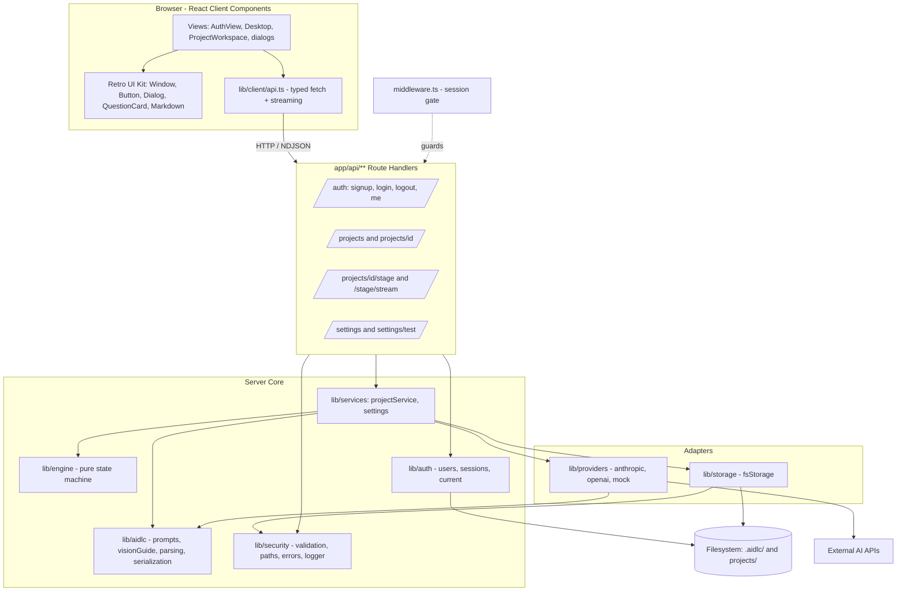
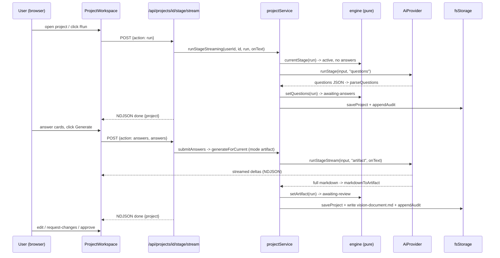

# System Architecture — Vision Studio

## System Overview

Vision Studio is a **modular monolith**: a single deployable Next.js 14 (App Router) + TypeScript application with a clean internal layering and swappable adapters at the edges (AI provider, storage). The browser renders React client components; Next.js Route Handlers under `app/api/**` form the HTTP boundary; a `middleware.ts` enforces authentication; a service layer orchestrates a **pure** workflow engine, the AI provider adapters, the auth layer, and filesystem storage. Security-critical concerns (validation, safe paths, error normalization, logging) are isolated in `lib/security/`.

## Architecture Diagram

**Text alternative (layers, top to bottom):**
1. **Browser** — Views compose the Retro UI Kit and call `lib/client/api.ts` (typed fetch + streaming).
2. **middleware.ts** — checks the `vs_session` cookie; redirects unauthenticated page requests to `/login` and returns 401 for unauthenticated API calls.
3. **Route Handlers** (`app/api/**`) — thin HTTP boundary: auth, projects, stage actions (incl. streaming), settings.
4. **Server Core** — `projectService` orchestrates the pure `engine`, the `aidlc` prompt/parse content, `auth`, and `security`.
5. **Adapters** — `providers` (Anthropic/OpenAI/Mock) and `storage` (filesystem).
6. **Filesystem + External AI APIs** — persistence and the LLM calls.

## Component Descriptions

| Component | Purpose | Key responsibilities | Depends on | Type |
|---|---|---|---|---|
| Retro UI Kit (`components/retro/`) | Reusable retro-desktop primitives | Window/Dialog chrome, Button variants, QuestionCard, Markdown renderer, form inputs | — (presentational) | Application (UI) |
| Views (`components/views/`, `app/**/page.tsx`) | Screens wired to the API | Auth, project list, new-project dialog, workspace (Q&A + editor + streaming), settings | Retro Kit, client api | Application (UI) |
| Client API (`lib/client/api.ts`) | Typed browser→server calls | fetch wrappers, NDJSON stream reader, shared input/response types | Routes | Application |
| Route Handlers (`app/api/**`) | HTTP boundary | validate (Zod) → `requireUser()` → delegate to service → typed JSON / stream | Service, Auth, Security | Application |
| Middleware (`middleware.ts`) | AuthN gate | session-cookie check; redirect/401 | Auth (cookie name) | Application |
| Project Service (`lib/services/projectService.ts`) | Transactional core | every business transaction; mutate Run, call provider, persist, append audit | Engine, Aidlc, Providers, Storage, Security | Application |
| Settings (`lib/services/settings.ts`) | Provider config per user | public vs resolved settings, env fallback, update + test | Storage paths, Security | Application |
| Engine (`lib/engine/`) | Pure workflow state machine | `createRun`, `setQuestions/Answers/Artifact`, `approve`, `requestChanges`, `skip`, `resetFrom` | — (pure) | Application (core) |
| AI-DLC Content (`lib/aidlc/`) | Prompts + guide + (de)serialization | `buildSystemPrompt`/`buildUserPrompt`, `VISION_GUIDE`, `parseQuestions`, `markdownToArtifact`, project ↔ JSON | Engine types | Application (core) |
| Providers (`lib/providers/`) | LLM adapters | `AiProvider` interface; Anthropic + OpenAI (stream + non-stream + test); Mock | Aidlc, Security | Adapter |
| Storage (`lib/storage/`) | Persistence adapter | list/get/save/delete projects, write artifacts, append audit | Security paths, config | Adapter |
| Auth (`lib/auth/`) | Identity + sessions | scrypt hashing, session tokens, cookie helpers, current user | Filesystem, Security | Application |
| Security Kit (`lib/security/`) | Cross-cutting safety | Zod schemas, safe paths, AppError/`toUserError`, structured logger | — | Application (core) |

## Data Flow — Generate a Vision Document (key workflow)

**Text alternative:** On "Run", the service detects the stage is active with no answers, calls the provider in `questions` mode, parses the JSON questions, moves the stage to `awaiting-answers`, and persists. After the user answers, `submitAnswers` immediately runs the provider in `artifact` mode (streaming deltas to the browser), converts the markdown to an artifact, moves the stage to `awaiting-review`, and persists the document + audit entry. The user then edits, requests changes, or approves.

## Integration Points

- **External APIs:** Anthropic Messages API (`https://api.anthropic.com/v1/messages`) and OpenAI Chat Completions (`https://api.openai.com/v1/chat/completions`), both with SSE streaming. Selected per-user via settings; Mock provider requires no network.
- **Databases:** None. Persistence is the local filesystem (JSON + markdown files).
- **Third-party services:** None beyond the LLM providers.

## Infrastructure Components

- **CDK / Terraform / CloudFormation:** None present.
- **Deployment model:** Local-first (`npm run dev` / `npm start`). `next.config.js` sets `output: 'standalone'`, enabling a self-contained Node server (Docker-friendly). Data locations are configurable via `AIDLC_DATA_DIR` / `AIDLC_PROJECTS_DIR`; HTTPS-only cookies via `AIDLC_HTTPS=true`.
- **Networking:** None managed by the app (single Node process; no VPC/LB/CDN in local mode).
