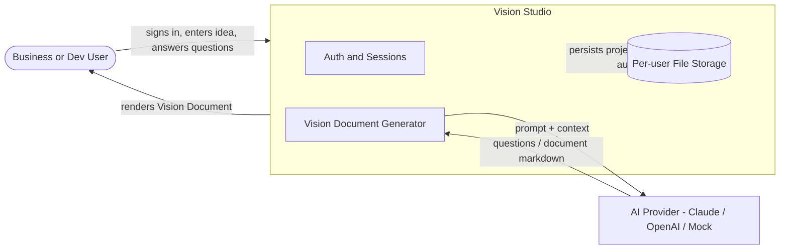

# Business Overview — Vision Studio

> Reverse-engineered from the current codebase (read-only analysis). This describes the **shipped behavior today**, which is narrower than the aspirational v1 `requirements.md`.

## Business Description

**Vision Studio** (internal name "AI-DLC Studio") is a local-first, deploy-ready web application that turns a user's idea into a polished, structured **Vision Document** through an AI-guided question-and-answer workflow. A signed-in user describes an idea; the AI asks a short batch of idea-specific clarifying questions; the user answers them in retro "dialog cards"; the AI then generates a complete Vision Document (Executive Summary, Business Context, Full Scope Vision, MVP Scope, Risks & Dependencies). The user can edit the document inline, request AI revisions (including highlight-and-comment revisions), and finally approve it.

The application is multi-user (username/password auth, session cookies) with per-user data isolation, and supports pluggable AI providers (Anthropic Claude, OpenAI, or a deterministic Mock provider for key-free runs).

> **Scope note (important for this feature cycle):** Although the methodology and v1 docs describe a full AI-DLC lifecycle, the **engine currently models a single stage** (`StageId = 'vision'`, `PhaseId = 'inception'`). In practice the product is a **single-type Vision Document generator**. The new "Multi-Type Vision Documents" feature expands this single document type into several selectable types.

## Business Context Diagram

**Text alternative:** A user signs in to Vision Studio and submits an idea. The Vision Document Generator builds a prompt and calls an external AI Provider (Claude, OpenAI, or Mock), which returns clarifying questions and later the document markdown. Everything is persisted to per-user file storage, and the rendered document is shown back to the user.

## Business Transactions

| # | Transaction | Description |
|---|---|---|
| BT-1 | Sign Up | Create a user account (username + password; scrypt hash, per-user salt). |
| BT-2 | Log In | Authenticate and receive a session cookie (`vs_session`, 30-day TTL, server-revocable, login rate-limited). |
| BT-3 | Log Out | Invalidate the current session. |
| BT-4 | Create Project from Idea | Provide name + idea + "is existing project?" flag; initializes a project with the `vision` stage active. |
| BT-5 | Run Stage → Clarifying Questions | AI generates 3–5 idea-specific multiple-choice questions (with mandatory "Other" free-text). |
| BT-6 | Submit Answers | Persist the user's answers; auto-advances to document generation. |
| BT-7 | Request More Questions | Ask deeper clarifying questions before generating the document. |
| BT-8 | Run Stage → Generate Vision Document | AI generates the full Vision Document markdown (streamed token-by-token). |
| BT-9 | Edit Artifact | User edits document markdown directly (version increments, `editedByUser` set). |
| BT-10 | Request Changes | User feedback → AI regenerates the document applying the feedback. |
| BT-11 | Revise with Anchored Comments | User highlights spans and leaves notes → AI rewrites the full document preserving unmarked content. |
| BT-12 | Approve Stage | Finalize the document; stage marked `done`; workflow complete. |
| BT-13 | List / Open / Delete Projects | Manage the user's projects (each is an on-disk folder). |
| BT-14 | Configure Provider | Set active AI provider, model, and API key (per user); test the connection. |

## Business Dictionary

| Term | Meaning |
|---|---|
| **Idea** | The free-text prompt the user wants turned into a Vision Document. |
| **Project** | A persisted unit of work: idea + run state + artifacts + audit, owned by one user. |
| **Run** | The workflow-engine state for a project (`currentStageId` + per-stage state). |
| **Stage** | A step in the run. Today there is exactly one: `vision`. |
| **Question / Answer** | AI-generated multiple-choice question (A/B/…/Other) and the user's selection(s). |
| **Artifact** | A generated, versioned markdown document (today: `vision-document.md`). |
| **Vision Guide** | The canonical section structure/rules the AI must follow when writing the document. |
| **Provider** | A swappable AI backend implementing the `AiProvider` interface. |

## Component-Level Business Descriptions

- **Auth (`lib/auth/`)** — Identity and sessions; gates all project access; isolates each user's data.
- **Project Service (`lib/services/projectService.ts`)** — The transactional core; orchestrates engine + provider + storage for every business transaction above.
- **Workflow Engine (`lib/engine/`)** — Pure state machine modeling the run/stage lifecycle (question → answer → artifact → approve).
- **AI-DLC Content (`lib/aidlc/`)** — Prompt building, the Vision Guide, and parsing/serialization of model output and persisted state.
- **Provider Layer (`lib/providers/`)** — Talks to Claude/OpenAI, or returns deterministic Mock output for key-free use.
- **Storage (`lib/storage/`)** — Persists projects, artifacts, and audit logs to disk per user.
- **Views / Retro UI (`components/`, `app/`)** — The retro-desktop screens the user interacts with.
