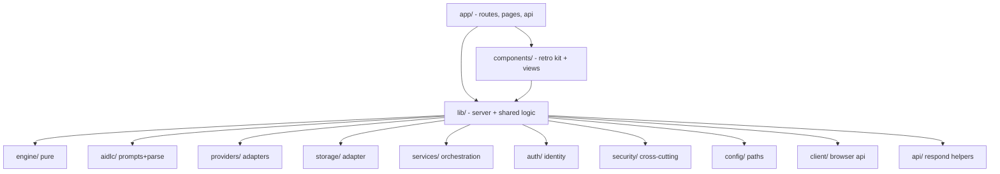

# Code Structure — Vision Studio

## Build System
- **Type:** npm + Next.js 14 (App Router). Scripts in `package.json`: `dev`, `build` (`next build`), `start`, `lint` (`next lint`), `test` (`vitest run`), `test:watch`, `typecheck` (`tsc --noEmit`).
- **Configuration:** `tsconfig.json` (strict mode, `noEmit`, `isolatedModules`, path alias likely `@/*`), `next.config.js` (`output: 'standalone'`, CSP/security headers), `middleware.ts` (auth gate). Tests under `tests/` run on Vitest with `fast-check`.

## Module Hierarchy

**Text alternative:** `app/` (routes/pages/api) and `components/` both depend on `lib/`. `lib/` contains: `engine` (pure), `aidlc`, `providers`, `storage`, `services`, `auth`, `security`, `config`, `client`, and `api` helper modules.

## Existing Files Inventory (modification candidates)

### Routing & Pages (`app/`)
- `app/layout.tsx` — root layout (global CSS, fonts/metadata).
- `app/globals.css` — hand-written retro theme (color variables + utility/component classes; ~250 lines). **No Tailwind.**
- `app/page.tsx` — home; renders Desktop (project list) for the signed-in user.
- `app/login/page.tsx` — login/signup page (renders `AuthView`).
- `app/project/[id]/page.tsx` — project workspace page (renders `ProjectWorkspace`).
- `app/api/auth/{signup,login,logout,me}/route.ts` — auth endpoints.
- `app/api/projects/route.ts` — list (GET) / create (POST) projects.
- `app/api/projects/[id]/route.ts` — get (GET) / delete (DELETE) a project.
- `app/api/projects/[id]/stage/route.ts` — non-streaming stage actions (POST).
- `app/api/projects/[id]/stage/stream/route.ts` — streaming stage actions (POST, NDJSON).
- `app/api/settings/route.ts` — get/update provider settings.
- `app/api/settings/test/route.ts` — test provider connectivity.

### UI (`components/`)
- `components/retro/Window.tsx`, `Button.tsx`, `Dialog.tsx`*, `QuestionCard.tsx`, `Markdown.tsx`, `Shell.tsx`, `ui.tsx` — retro UI kit. *(Dialog primitive referenced by views.)*
- `components/views/AuthView.tsx` — login/signup form.
- `components/views/Desktop.tsx` — project grid, new-project + settings entry points, provider readiness.
- `components/views/NewProjectDialog.tsx` — **captures name + idea + greenfield/existing flag** (where document-type selection would be added).
- `components/views/ProjectWorkspace.tsx` — questions UI, streaming generation, artifact editor, approve/request-changes/revise.
- `components/views/SettingsDialog.tsx` — provider/model/API-key configuration.

### Server & Shared (`lib/`)
- `lib/engine/types.ts` — domain model (`Project`, `Run`, `StageState`, `Question`, `Answer`, `Artifact`, `StageResult`; `StageId='vision'`, `PhaseId='inception'`).
- `lib/engine/stages.ts` — `STAGES` (single `vision` def), `getStageDef`, `stageIndex`, `PHASE_TITLES`.
- `lib/engine/machine.ts` — pure transitions (`createRun`, `setQuestions/Answers/Artifact`, `approve`, `requestChanges`, `skip`, `resetFrom`, `nextStageId`).
- `lib/aidlc/prompts.ts` — `buildSystemPrompt(mode)`, `buildUserPrompt(input, mode)`, `stageAsksQuestions`.
- `lib/aidlc/visionGuide.ts` — `VISION_GUIDE` (required document sections/rules).
- `lib/aidlc/parsing.ts` — pure JSON/markdown extraction + Zod validation (`parseQuestions`, `parseStageResult`, `markdownToArtifact`, `extractJson`).
- `lib/aidlc/serialization.ts` — `serializeProject` / `deserializeProject` (Zod-validated on read).
- `lib/providers/provider.ts` — `AiProvider` interface, `StageInput`, `StageMode`.
- `lib/providers/anthropic.ts`, `openai.ts`, `mock.ts`, `index.ts` — provider impls + `buildProvider`/`getProvider`.
- `lib/storage/storage.ts` (interface), `fsStorage.ts` (impl), `index.ts` (`getStorage(userId)` with caching).
- `lib/services/projectService.ts` — orchestration (see API doc for method list).
- `lib/services/settings.ts` — `getPublicSettings`, `getResolvedSettings`, `updateSettings`.
- `lib/auth/users.ts`, `sessions.ts`, `current.ts` — identity, sessions, current-user/cookie helpers.
- `lib/security/validation.ts` (Zod schemas), `paths.ts` (`safeJoin`/`safeId`/`safeRelPath`), `errors.ts` (`AppError`/`toUserError`), `logger.ts` (structured + redaction).
- `lib/config/paths.ts` — `DATA_DIR`, `AIDLC_DIR`, `PROJECTS_DIR` (env-overridable).
- `lib/client/api.ts` — typed browser API client + streaming helper.
- `lib/api/respond.ts` — `jsonOk` / `jsonError` response helpers.

### Tests (`tests/`)
- `tests/parsing.test.ts`, `tests/serialization.test.ts`, `tests/machine.test.ts` — example + property-based tests for the pure core.

## Design Patterns

### Pure core / impure edges
- **Location:** `lib/engine/*`, `lib/aidlc/{parsing,serialization}.ts` are pure; I/O is confined to services/providers/storage/auth.
- **Purpose:** deterministic, property-testable logic; side effects isolated.
- **Implementation:** every `machine.*` returns a new `Run`; parsing/serialization are referentially transparent.

### Adapter / Strategy at the edges
- **Location:** `lib/providers/` (AiProvider) and `lib/storage/` (Storage interface + FsStorage).
- **Purpose:** pluggable AI backend and deploy-ready persistence with no core rewrite.
- **Implementation:** interface + concrete classes selected at runtime (`getProvider`, `getStorage`).

### Generic stage runner
- **Location:** `projectService` + data-defined `STAGES`.
- **Purpose:** one code path runs "the current stage" regardless of which stage it is — the seam the multi-type feature builds on.

### Thin controllers
- **Location:** `app/api/**/route.ts` → validate → `requireUser` → delegate → respond.
- **Purpose:** keep HTTP concerns out of business logic.

## Critical Dependencies (code-level)
- **next ^14.2.33** — App Router, Route Handlers, middleware, standalone output.
- **react / react-dom 18.3.1** — UI.
- **zod 3.23.8** — input + persisted-data validation (every untrusted boundary).
- **react-markdown 9.0.1 + remark-gfm 4.0.0** — artifact rendering (tables/checklists).
- **node:crypto / node:fs/promises / node:path** — hashing, persistence, safe paths (no external crypto/db deps).
- **vitest 2.0.5 + fast-check 3.20.0** (dev) — unit + property-based tests.
