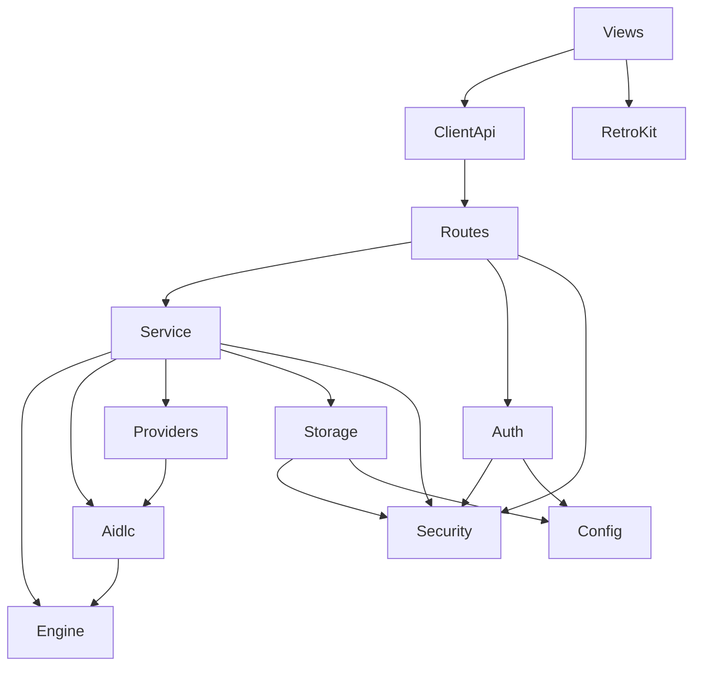

# Dependencies — Vision Studio

## Internal Dependencies (module graph)

**Text alternative:** Views depend on the Client API and Retro Kit. The Client API calls Route Handlers, which depend on the Service, Auth, and Security. The Service depends on Engine (pure), AI-DLC content, Providers, Storage, and Security. Providers depend on AI-DLC content; AI-DLC content depends on Engine types. Storage and Auth depend on Security and Config. Engine and Security have no internal dependencies (leaf modules).

### Key internal edges
- **Service → Engine** (Runtime): drive pure state transitions.
- **Service → Providers** (Runtime): obtain questions/artifact from the LLM (or Mock).
- **Service → Storage** (Runtime): persist project/artifacts/audit.
- **Providers → AI-DLC content** (Runtime): build prompts, parse output.
- **Routes/Storage/Auth → Security** (Compile/Runtime): validation, safe paths, error/log normalization.

## External Dependencies

### Runtime
| Dependency | Version | Purpose | License |
|---|---|---|---|
| next | ^14.2.33 | App framework, API routes, middleware, standalone output | MIT |
| react | 18.3.1 | UI library | MIT |
| react-dom | 18.3.1 | React DOM renderer | MIT |
| react-markdown | 9.0.1 | Markdown rendering of artifacts | MIT |
| remark-gfm | 4.0.0 | GFM tables/checklists | MIT |
| zod | 3.23.8 | Runtime schema validation | MIT |

### Development
| Dependency | Version | Purpose | License |
|---|---|---|---|
| typescript | 5.5.4 | Type checking / compilation | Apache-2.0 |
| vitest | 2.0.5 | Test runner | MIT |
| fast-check | 3.20.0 | Property-based testing | MIT |
| @types/node | 20.14.11 | Node type defs | MIT |
| @types/react | 18.3.3 | React type defs | MIT |
| @types/react-dom | 18.3.0 | React DOM type defs | MIT |

### Notes
- **Supply-chain posture (SECURITY-10):** versions are pinned/constrained and a lockfile is present; no `latest` tags. Dependency surface is intentionally small.
- **No external crypto/DB/auth libraries:** hashing, sessions, and persistence use Node built-ins (`node:crypto`, `node:fs/promises`, `node:path`), reducing supply-chain risk.
- **AI provider SDKs not used:** Anthropic/OpenAI are called over `fetch` directly (no vendor SDK dependency).
